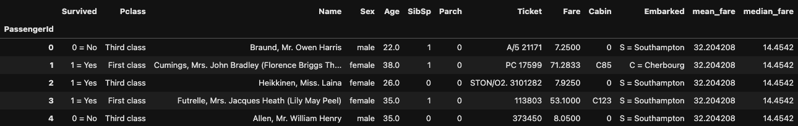

<h1 align="center" id="title">Data Science Titanic Activity</h1>

This exercise is part of my college homework assignment. It involves analyzing a dataset about the Titanic specifically focusing on the survivors their ages and other relevant information. To help with this I've gone through the "10 minutes to pandas" guide from the documentation as well as the pandas cookbook which has been really useful for this project.

<h2>Project Screenshots:</h2>

  
  
<h2>💻 Built with</h2>

Technologies used in the project:

*   pandas
*   Matplotlib
*   python
*   Jupyter Notebook
